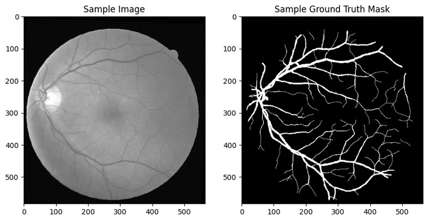

# Retinal Vessel Segmentation with U-Net

A U-Net implementation built with PyTorch for retinal blood vessel segmentation on the DRIVE dataset.

## 📌 Project Overview

Retinal vessel segmentation is a critical task in medical image analysis, used to assist in the diagnosis of diseases such as diabetic retinopathy and glaucoma. This project implements the U-Net architecture to perform binary segmentation — identifying blood vessels from retinal fundus images.

**Dataset:** [DRIVE (Digital Retinal Images for Vessel Extraction)](https://www.kaggle.com/datasets/andrewmvd/drive-digital-retinal-images-for-vessel-extraction)

## 🖼️ Visualization



*Left: Retinal fundus image (.tif) — Right: Ground truth vessel mask (.gif)*

## 📊 Results

Evaluated on all 20 test images from the DRIVE dataset:

| Metric | Score |
|--------|-------|
| **mIoU** | **0.6932** |
| **Mean F1 Score** | **0.8186** |

Per-image results:

| Image | IoU | F1 Score |
|-------|-----|----------|
| 1 | 0.7036 | 0.8260 |
| 2 | 0.7212 | 0.8380 |
| 3 | 0.6457 | 0.7847 |
| 4 | 0.7084 | 0.8293 |
| 5 | 0.6960 | 0.8207 |
| 6 | 0.6863 | 0.8140 |
| 7 | 0.6869 | 0.8144 |
| 8 | 0.6663 | 0.7998 |
| 9 | 0.6741 | 0.8054 |
| 10 | 0.6838 | 0.8122 |
| 11 | 0.6618 | 0.7965 |
| 12 | 0.7166 | 0.8349 |
| 13 | 0.7080 | 0.8290 |
| 14 | 0.7109 | 0.8310 |
| 15 | 0.6781 | 0.8082 |
| 16 | 0.7230 | 0.8392 |
| 17 | 0.6791 | 0.8089 |
| 18 | 0.6818 | 0.8108 |
| 19 | 0.7483 | 0.8560 |
| 20 | 0.6834 | 0.8119 |

## 🏗️ Model Architecture

U-Net with encoder-decoder structure and skip connections:

```
Encoder (Contracting Path):
  Input → DoubleConv(1→64) → MaxPool
        → DoubleConv(64→128) → MaxPool
        → DoubleConv(128→256) → MaxPool
        → DoubleConv(256→512) → MaxPool

Bottleneck:
        → DoubleConv(512→1024)

Decoder (Expanding Path):
        → UpConv + Skip → DoubleConv(1024→512)
        → UpConv + Skip → DoubleConv(512→256)
        → UpConv + Skip → DoubleConv(256→128)
        → UpConv + Skip → DoubleConv(128→64)
        → Conv1x1 → Output (1 channel)
```

Each `DoubleConv` block: Conv2d → BatchNorm → ReLU → Conv2d → BatchNorm → ReLU

| Hyperparameter | Value |
|----------------|-------|
| Loss Function | DiceLoss + BCEWithLogitsLoss |
| Optimizer | Adam |
| Epochs | 200 |
| Batch Size | 1 |
| Input Channels | 1 (grayscale) |
| Output Classes | 1 (binary mask) |

## 🔧 Data Pipeline

**Preprocessing:**
- Read retinal images in `.tif` format
- Read ground truth masks in `.gif` format
- Convert to grayscale tensors

**Data Augmentation (training only):**
- Random horizontal flip
- Random vertical flip
- Random rotation (±15°)
- Random affine translation

**Evaluation Metrics:**
- **IoU (Intersection over Union):** pixel-level overlap between prediction and ground truth
- **F1 Score:** harmonic mean of precision and recall on segmented pixels

## 📁 Project Structure

```
Retinal-Vessel-Segmentation/
├── u-net.ipynb          # Main notebook (training + evaluation)
├── training/
│   ├── images/          # .tif retinal fundus images
│   └── groundtruth/     # .gif vessel masks
├── test/
│   ├── images/          # .tif test images
│   └── groundtruth/     # .gif test masks
├── prediction/          # Output segmentation masks (generated)
├── requirements.txt
└── README.md
```

## 🚀 Getting Started

### 1. Clone the repo

```bash
git clone https://github.com/ned0624/Retinal-Vessel-Segmentation.git
cd Retinal-Vessel-Segmentation
```

### 2. Install dependencies

```bash
pip install -r requirements.txt
```

### 3. Download the dataset

Download the DRIVE dataset from the [official site](https://drive.grand-challenge.org/) and place the files as shown in the project structure above.

### 4. Run the notebook

Open `u-net.ipynb` in Jupyter and run all cells sequentially.

## 🛠️ Tech Stack

- **Python** 3.8+
- **PyTorch** — model definition, training loop, GPU support
- **OpenCV / PIL** — image I/O and preprocessing
- **imageio** — reading `.gif` ground truth masks
- **tifffile** — reading `.tif` retinal images
- **scikit-learn** — F1 score computation
- **Matplotlib** — visualization

## 💡 Key Concepts Demonstrated

- U-Net encoder-decoder architecture with skip connections
- Custom combined loss: Dice Loss + BCEWithLogitsLoss
- IoU and F1 evaluation for binary segmentation
- Medical image data loading (`.tif`, `.gif` formats)
- Data augmentation for small medical datasets

---

*DRIVE dataset: Staal et al., "Ridge based vessel segmentation in color images of the retina," IEEE TMI, 2004.*
